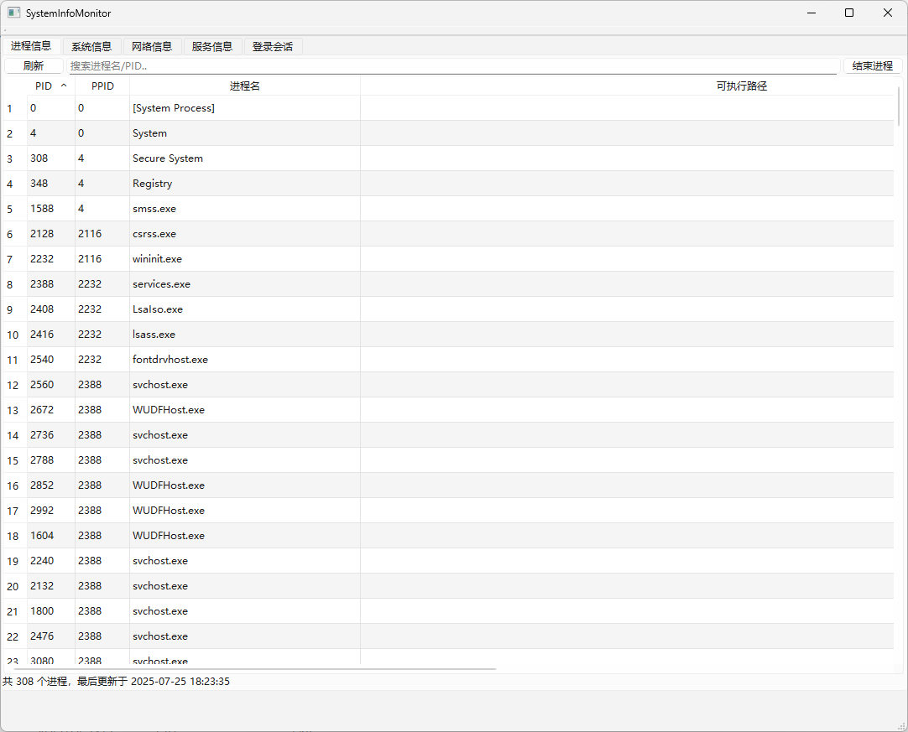
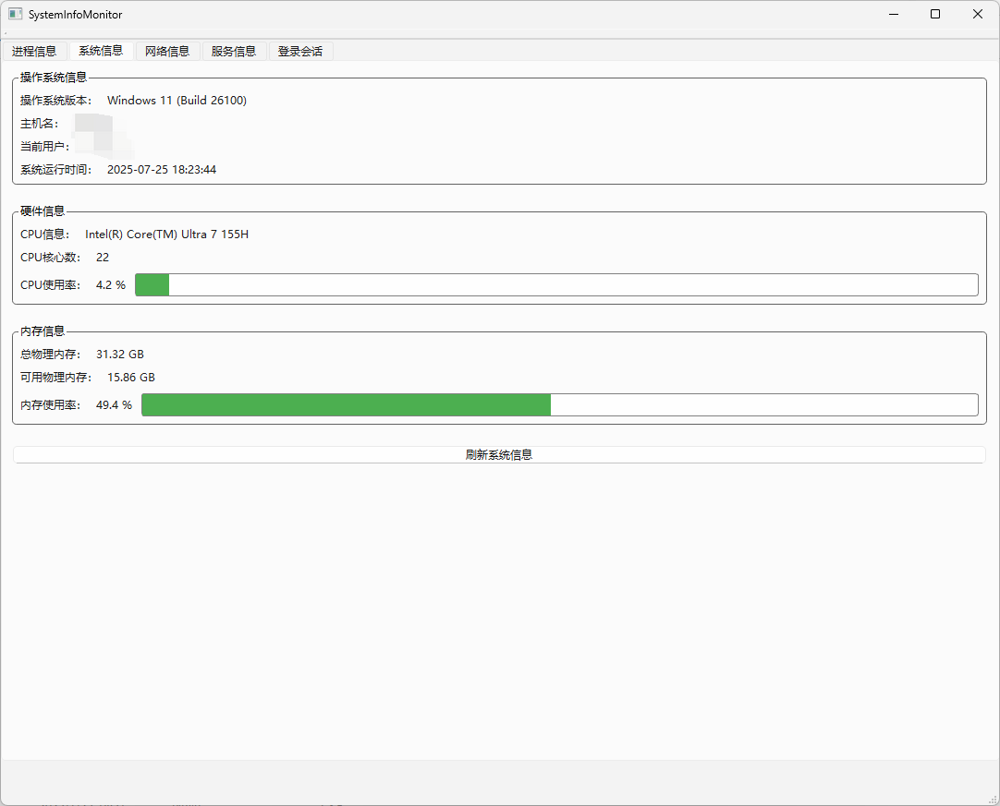
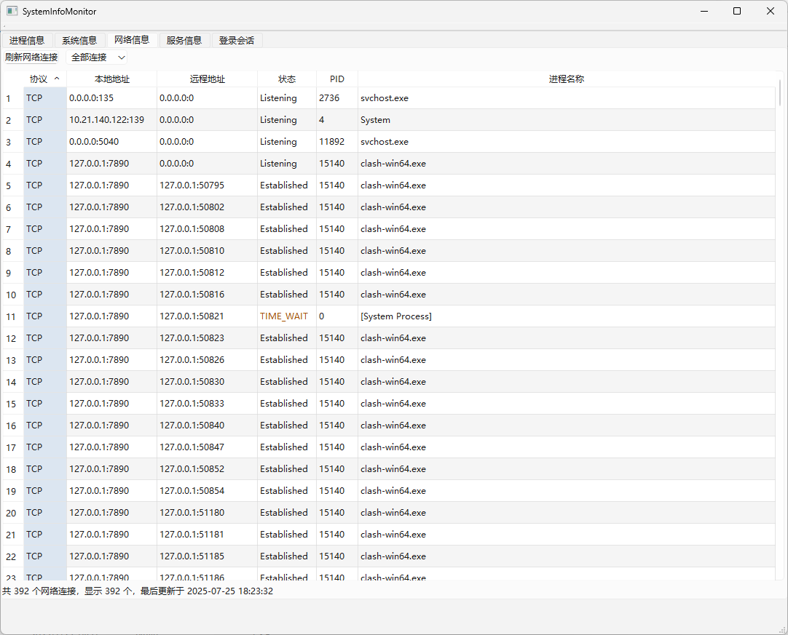
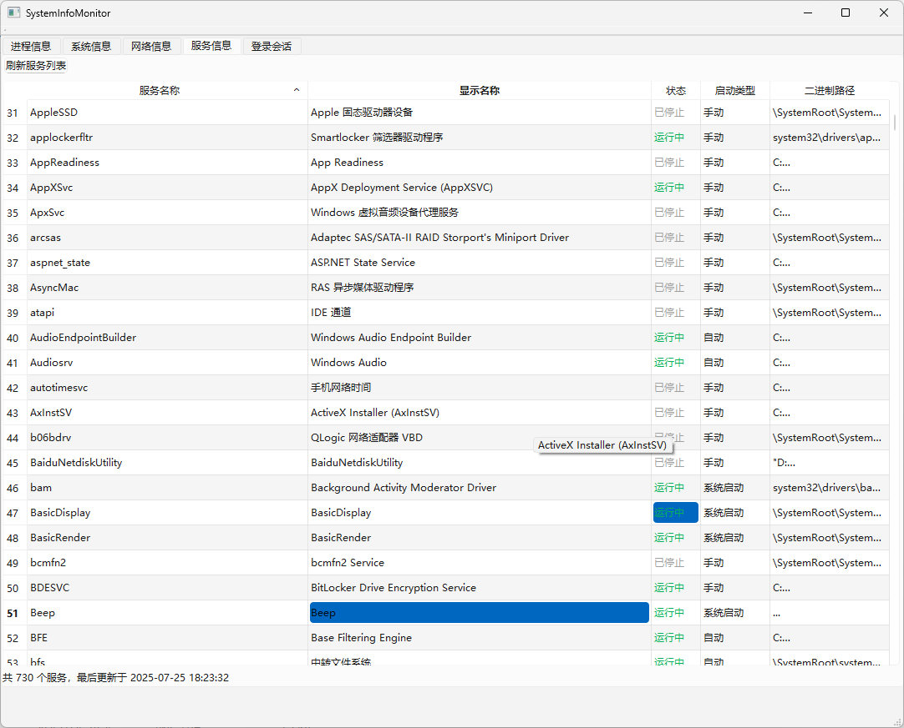
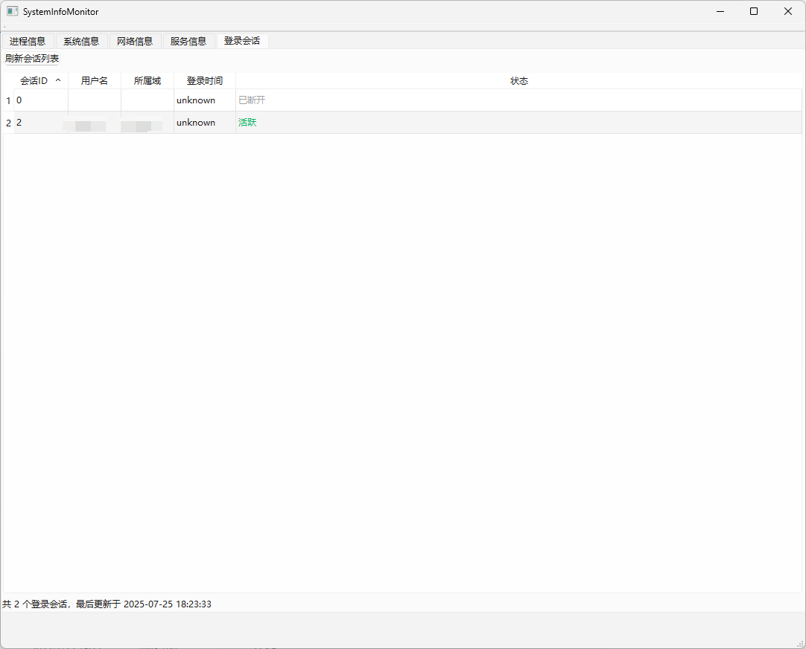

# System Security Monitor - 项目说明

## 项目概述
System Security Monitor 是一款针对 Windows 系统的安全监控工具，旨在通过实时采集和展示关键系统信息，帮助安全人员与运维人员快速掌握主机运行状态，及时发现潜在的异常或风险。项目基于跨平台框架与系统原生接口开发，目前已完成核心数据采集逻辑，正处于功能完善阶段。

## 技术栈
- **开发框架**：Qt（用于构建桌面应用框架，预留前端界面扩展能力）
- **系统接口**：Win32 API（核心数据采集依赖）
- **开发语言**：C++（遵循 C++17 标准）
- **关键库**：`ws2_32.lib`、`iphlpapi.lib`、`advapi32.lib`、`psapi.lib`

## 主要界面截图

| 标签页功能       | 界面截图                                                                 |
|------------------|--------------------------------------------------------------------------|
| 进程标签页       |                       |
| 系统信息标签页   |               |
| 网络连接标签页   |                   |
| 服务标签页       |                       |
| 会话标签页       |                       |

## 已实现功能
基于需求分析，目前已完成**核心数据采集模块**，具体包括：

1. **进程监控**
   - 枚举所有运行中进程的完整信息（PID、父PID、进程名、可执行文件路径、命令行参数、创建时间、内存占用、CPU时间）
     
2. **服务监控**
   - 枚举系统所有服务的关键信息（服务名、显示名称、运行状态、启动类型、可执行文件路径）
   - 支持服务状态解析与标准化（如“运行中”“已停止”等状态映射）

3. **网络连接监控**
   - 采集所有TCP/UDP连接详情（协议类型、本地地址:端口、远程地址:端口、连接状态、关联进程PID）
   - 支持IP地址格式化、端口转换（网络字节序转主机字节序）

4. **用户会话监控**
   - 枚举当前系统登录会话信息（会话ID、用户名、所属域、登录时间、会话状态）

5. **系统信息概览**
   - 收集基础系统信息（操作系统版本、主机名、当前登录用户、系统启动时间、物理内存使用情况、CPU核心数与型号）

6. **数据刷新机制**
   - 实现定时刷新逻辑（支持自定义间隔）与手动刷新接口

## 项目现状
- **已完成阶段**：核心数据采集模块开发，所有监控维度的底层函数已实现，数据解析与格式化逻辑通过测试。
- **待开发阶段**：
  - Qt前端界面（计划通过QTableWidget、QTabWidget实现多标签页展示，支持排序、搜索、筛选功能）
  - 交互功能（进程结束、服务启停等操作的UI触发与权限管理）
  - 告警功能（可疑进程高亮、状态变更提示等）
  - 性能优化（高频刷新场景下的资源占用控制）

## 后续规划
1. 开发Qt前端界面，完成数据可视化与用户交互
2. 实现进程/服务操作的权限校验与安全提示
3. 扩展数据导出功能（支持导出为CSV/JSON格式）
4. 优化监控性能，降低系统资源占用
5. 增加高级告警规则配置（自定义可疑特征）

## 备注
项目目前聚焦于底层数据采集的准确性与稳定性，前端界面将基于现有数据接口快速开发，最终目标是提供轻量、高效的系统安全监控工具，满足运维与安全分析的基础需求。